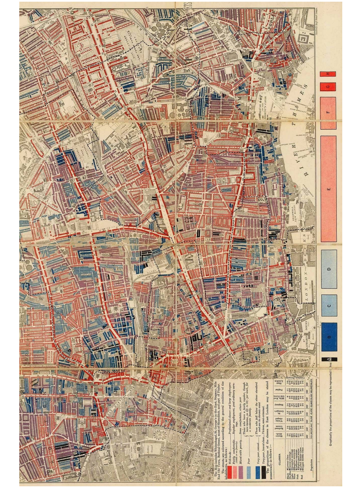
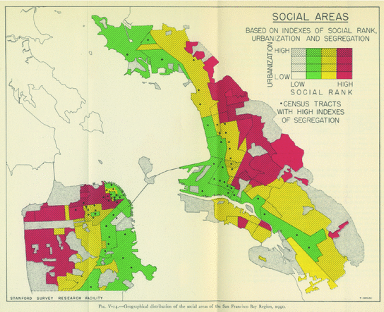
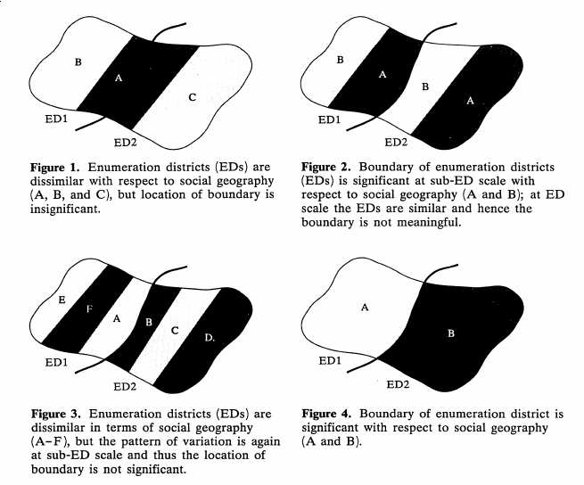

This paper offers a critical introduction to *geodemographic analysis*,
reviewing the relevant literature so as to understand the current state
of research, to identify unresolved questions and issues requiring
further study, and to develop an agenda of priorities for this doctoral
thesis. 

We begin by setting our study within the context of the ubiquitous
practice of locational inference. Next, we introduce geodemographics
itself, offering a description and explanatory etymology.  We then
review the historical antecedents of geodemographic analysis in more
detail: the groundbreaking visualizations of nineteenth-century urban
thematic cartography; the rich investigative agenda of the early Chicago
School's human ecology; and the shift to quantitative social area
analysis and factorial ecology.  From there, we examine the subsequent
development and discussion of geodemographics within British academia,
finding two principal components in the debate which continue to
generate heated controversy: the ethical dimension of social
surveillance on the one hand, and the ontological dimension of
neighbourhood definition on the other.  Consideration of the first leads
us to appreciate the importance of free and open source geodemographic
classifications, which have now become well-estalished; consideration of
the second leads us to a survey of the intrinsic problems of the areal
zone design, and a deeper consideration of neighbourhood dynamics and
ontology.  Finally, we review developments in the techniques of areal
interpolation of data from some original geographic frame of reference
to an alternative geography. We conclude by summarizing the specific
research goals resulting from our review of the literature.

# The Ubiquity of Locational Inference

On meeting a person for the first time, it is common to ask *'Where are
you from?'* [@GMyers2006]. Knowing something about the place with which
a person is associated reveals something about that person -- such is
the implicit and necessary logic underlying this question, and its
commonplace conventionality reveals it to be a very widespread
conviction. It may then turn out that the place is known directly to the
one asking, in which case it may be considered in its unique
specificity. More likely however, it will not: the contextual
understanding gained from the answer must then be mediated by an attempt
to fit the reply into some more generalized classificatory framework.
This will enable the construction of analogies with other places of
which the enquirer does have direct experience, and the conversation can
progress. Such a process will more likely happen instinctively than
reflectively, but it inevitably must happen -- even if the (possibly
subconscious) mental function to find an appropriate known category for
the place in question returns an error.

Indeed, before the question 'Where are you from?' is verbally uttered,
a provisional estimate of the answer will already have been made, on the
basis of visual, auditory, and even olfactory clues. Skin tone, eye
colour, facial features, and other physical characteristics reflect
genetic variations optimized over millenia for particular environments
[@MBamshadOlson2003]. Accent and vocabulary mark the region in which the
speaker learned to speak a language [@PBoland2010; @DWeatherheadEtAl2016]. 
Clothing and other worn accessories differ according to what is
culturally fashionable and commercially viable in different places
[@LCrewe2017]; so do perfumes, deodorants, and other noticeably fragrant
grooming products [@JHavlicekRoberts2013]. The lingering smell of
certain spices is suggestive of a diet shaped by a family background in
a place where such ingredients were inexpensively available
[@MMallapragada2016].

But such qualitative interpretation of individual locational clues is
inherently time-consuming [@BCypress2019] and subjective [@MKalu2019].

# Geodemographics: The Analysis of People By Where They Live

Geodemographic analysis provides a quantitative approach to the
"analysis of people by where they live" [@PSleight1997;
@RHarrisEtAl2005; @RWebberBurrows2018].  By applying unsupervised
machine learning to the demographic data associated with geographic
areas, the complex multidimensional reality of human society can be
reduced to a more manageable number of statistical types. Having been
identified algorithmically, these *clusters* can then be described
qualitatively (@Tbl:oac_tbl) and presented visually (@Fig:oac_fig),
creating products that have been used with great success in fields
ranging from direct marketing [@MEvans1998], retail location selection
[@OGonzalez-BenitoGonzalez-Benito2005], political campaigning
[@RWebber2006; @JRobbin1980], and military recruitment
[@JDeReuRobbin1981], to social service resource allocation
[@PLongley2005] : whether that service be in the field of health
[@MFarrEtAl2008], education [@ASingletonLongley2009c], or policing
[@DAshbyLongley2005].

{#fig:oac_fig}

```{.table caption="An Example of Geodemographic Cluster Description:\newline Groups and Subgroups from the 2011 OAC, created by @CGaleEtAl2016 {#tbl:oac_tbl}"
source="../csv/oac2011_.csv"}
```

The word 'geodemographics' was coined by Jonathan @JRobbin1980 to
describe the marketing tool his company had developed
[@RWebberBurrows2018, p.94]. By classifying American residential zip
codes into groups with similar demographic characteristics, and then
giving each group a memorable label and summary description, he had
created a product designed to simplify the process of targeting
prospective customers and selecting promising retail locations
[@JDeReuRobbin1981]. Robbin's tool combined the latest in marketing
theory with cutting-edge methods in quantitative geographic sociology. 

*Market segmentation* [@WSmith1956] solved the problem of a complex
market of heterogenous customers by dividing it into several sub-markets
of homogenous customers. *Demographics* -- that is, population
attributes such as age, sex, income, and ethnicity -- offer
a straightforward way of applying this strategy. The idea of
*psychographics* [@WWells1975] is then to understand the psychology of
a typical customer from a given market segment, so as to anticipate
their needs, desires, and trigger points. Robbin added these techniques
to the *social area analysis* [@EShevkyBell1955] he had been applying as
a doctoral candidate at New York University [@Ricercar2021], assisting
Edgar Borgatta in researching ways of classifying the social
characteristics of American cities [@JHaddenBorgatta1965].

While clustering census tracts provides a way of segmenting them into
similar groups, the *ecological fallacy* [@WRobinson1950] means it does
not follow that individuals within tracts with similar population
demographics are necessarily similar at the individual level. The
argument for the likely homogeneity of census tract units is made by
reference to the account of the *neighbourhood* as a *natural area*
given by @RPark1925, who argued that the twin forces of homophily and
social influence will tend to segregate an urban population into
a "mosaic of social worlds" [@LWirth1938]. Park was the central figure
of the *Chicago School* [@AAbbott2017], whose distinctive *human
ecology* combined the empirical investigation exemplified by @CBooth1904
with the more theoretical sociology of @GSimmel1908, with whom he had
studied in Germany.

{#fig:BurgessDiagrams}

This account of geodemographic historiography is expressed in detail in
the collaborative monographs of @RHarrisEtAl2005 and
@RWebberBurrows2018. Booth's urban poverty maps offer "the first example
of applied geodemographics" [@RHarrisEtAl2005, p.30], the Chicago
School's theory of urban *natural areas* (@Fig:BurgessDiagrams) provides
the necessary "conceptual definition...[for] neighbourhood analysis"
[p.39], the increasing availability of census data then stimulates the
development of quantitative social area analysis and subsequent
factorial ecology [pp.39-40], paving the way for the emergence of
geodemographic products [p.55].

# The Historical Roots of Geodemographics

Modern *demography*, the science of enumerating populations, began with
@JGraunt1662 and his realization that London's mortality bills and
christening records could be used as data sources for an empirical
analysis of London's population growth [@DGlass1963]. Graunt's
demographic analysis was geographic, insofar as it dealt with data
records from different parishes, and suggested the role of migration
from rural parishes to London as a reason for the apparent ability of
the metropolis to sustain a higher rate of deaths than births
[@CTaeuber1941]. Graunt's work inspired mathematicians such as Huygens,
Leibniz, and Bernoulli in their development of classical probability
theory [@PKreager1993]. But his originality was in the way he saw the
socio-economic and political significance of numbering population
[@ZBayatrizi2008].

The most straightforward way to establish the number of a population is
simply to count it directly. Parliament debated the idea of a national
census in 1753, but the bill did not pass; it was seen as an
unprecedented intrusion into private matters, and some argued it was
"subversive of the last remains of English liberty"
[@HRobbins2010,p.202]. However, when the American colonies became
independent, and established themselves as a republican democracy, a
decennial census was made a constitutional requirement; a corallary of
the need "to ensure the civic empowerment of each individual"
[@TSullivan2020]. The first census of the USA was taken in 1790
[@MAnderson2015], and Europe followed suit shortly thereafter: Britain
in 1801 [@DGlass1978; @KLevitan2011], and France soon afterwards
[@JCole2000].

The new era of (nineteenth-century) 'big data', meant @JFletcher1847
could combine "the last Census of the Population; the Income Tax
Returns; the Home Office Tables of Criminal Offenders; the latest
Reports of the Poor Law Commissioners; and a Summary of Savings Banks"
(p.194) to produce a Comparison of the different Districts of England
and Wales, in respect to the Distribution of the Population, its Social
Organization, its Education and Ignorance, its Providence and
Improvidence, and its Crime, in which each county has been classified
"on the evidence of the occupation abstract of 1841, with a further
reference to their geographical contiguity, and the different origin of
the great body of their population". Within each district, counties were
also classed with regards to educational attainment. This
sociodemographic analysis is then visualized by a map of England (and
Wales) in which each county in coloured to show how it has been
classified (@Fig:Fletcher_EnglishRegions). Two years later he expanded
the work to included twelve shaded maps for each variable independently
[@HFunkhouser1937], apparently motivated by a comment from Prince Albert
[@HWainer2012].

{#fig:Fletcher_EnglishRegions}

At the smaller scale of the neighbourhood, a Church of England minister
in Liverpool called Abraham Hume [@LVaughan2018, p.62] organized a
detailed door-to-door survey of the social condition of his parishioners
[@AHume1850; @AHume1858], which he presented on a large coloured map
[@AHume1858a], showing simultaneously poverty, crime, health, church and
school data on a vertical plan of the city (@Fig:Hume_LiverpoolMap).
Poverty is shown by street, according to whether the street is classed
as 'wholly pauper' or partially so, as assessed by "the relieving
officers within the Borough" (p.21). 

{#fig:Hume_LiverpoolMap}

Hume is aware that a more precise analysis would be made possible "if we
could compare *houses, families, or individuals* relieved" (p.22)
Still, when @JTobias1974 applied modern mathematical methods to Hume's
data (examining p-value scores, chi-squared tests and correlation
coefficients) he found that "Hume's impressionistic descriptions have
been shown to be consistent with the data he collected but doubtless
never analysed in this way" [p.229]. Hume is also interested in patterns
of residential mobility and their effects on neighbourhood change; in
particular, the way that congregational Nonconformist churches (in
contrast to the territorial Established Church), tend to follow the
paths trod by the middle classes from the centre of a town to the
suburbs [@WPickering1972, p.42; @AWilcox2014, p.12].

Although the claim is widespread that Charles Booth's maps are the
first example of geodemographic visualization [@RHarrisEtAl2005, p.30;
@RBurrowsGane2006, p.794; @CDaltonThatcher2015, p.3;
@RWebberBurrows2018, p.31], we have seen that typological neighbourhood
mapping in fact preceded Booth by more than half a century
[@LVaughan2018, p.62; @ARobinson1982, p.184]. To state this takes
nothing away from Booth's magisterial work, which we can now consider
in more detail.

Charles Booth was a wealthy Liverpool shipowner and enthusiastic member
of the Royal Statistical Society, which he served for a time as
president [@CBooth1893]. He was also an earnest Unitarian, and felt a
sense of personal responsibility for the wretched conditions of poor
labourers [@CCollet1945]. In 1887, Booth began work on a "proposed
inquiry into the condition and occupations of the people of London"
[@CBooth1887], motivated perhaps by a "desire to prove the Socialists
wrong in their estimate of the extent of poverty in London"
[@HPfautz1967, p.21].  @RHarrisEtAl2005 [p.30] follow @HPfautz1967
[p.21] and @TSimeySimey1960 [p.69] in accepting the claim of
@HHyndman1911 [p.303] that he was a causal influence; however
@RODayEnglander1992 [p.30-31] disagree, arguing that althoguh Hyndman's
conclusions may have disturbed Booth, "they certainly did not provide
the main impetus for Booth's survey".  Over the next seventeen years,
Booth and his research team filled 450 notebooks with information about
the capital's living and working conditions, which were published in
three printed editions, the final running to seventeen volumes
[@SDonnelly2002]. Funding for the project came from the profits of
Booth's own commercial success [@SDonnelly2002]. 

Booth and his team drew on extensive interviews with the house-to-house
visitors employed by the School Board [@CBooth1887], which they combined
with anonymized data from the 1891 Census [@CBooth1893]. This
information then allowed each street block [@LVaughanGeddes2009] to be
allocated to one of his eight levels of deprivation. These in turn were
colour-coded according to their relative level of poverty, with darker
colours representing the poorer residential areas, although the precise
correspondence between class and colour turns out on close inspection to
be somewhat ambiguous [@MKimball2006].

{#fig:BoothMap}

Booth expressed his doubts that he could make his figures "as luminous
and picturesque to any other eye as they are to mine" [@CBooth1904,
p.63), but for some he certainly succeeded. The map (@Fig:BoothMap)
received intense media attention when it was first put on public display
[@KBales1999], and his methodology influenced other reform-minded social
researchers, such as @JAddams1895, @WDuBois1899, @BRowntree1902, and
@TMarr1904.

On the other hand, Booth was sidelined by the academic
institutionalization of sociology, marked in Britain by the appointment
of a first Professor of Sociology in 1904 at the London School of
Economics [@CTopalov1993]. When compared with the strongly theory-driven
work  of continental sociologists such as Durkheim and Weber, Booth's
"uncontrolled empiricism" has been judged to lack "clear objectives and
ideas" and "sociological imagination" [@JWestergaard1969]. Half a
century later, @TSimeySimey1960 attempted to position Booth as the
founding father of British sociology, but this was arguably driven
primarily by a desire to locate a respectable pedigree for their subject
[@RODayEnglander1992]. The claim that Booth invented the concept of 'the
poverty line' [@TSimeySimey1960, p.88] also fails under scrutiny;
@AGillie1996 shows that it must rather have come directly from the
London School Board, whose home-visitation workers supplied Booth's
project with information about families' living conditions, and which
was required by the implications of the 1870 Education Act to develop a
criterion of poverty.

Booth's statistical enthusiasm also lacked mathematical expertise
[@HSelvin1976]. The physicist @GYule1895 was provoked "to severely
criticize the [statistical] methods on which he bases his results"
(p.608), showing repeatedly (Yule gives sixteen specific examples) that
Booth claims his figures show no definite relation, when in fact a
strong numerical correlation is present. 

It is also worth noting explicitly that while Booth's research was
multivariate in its input [@WDavies1978], its output was not a true
multidimensional classification of different *types* of residential
neighbourhood, but rather a unidimensional index of poverty separated
into quantiles. In that respect it is more similar to the modern Index
of Multiple Deprivation [@IDeasEtAl2003] than a modern geodemographic
classification. This meant that Booth's analysis was ill-equipped to
deal with communities differentiated by factors other than his 
economic index, and it is thus unsurprising that he struggled to fit
Jewish immigrants into his schema [@DEnglander1989].

However, though Booth may have been sidelined by the development of
academic sociology in Britain, his style of detailed social survey had
somewhat more influence on its development in America, particularly
through the Chicago School.

The phrase 'Chicago School' implies an institution, a group of people,
a body of work, a set of ideas -- and a period of time during which
those entities were, if not isomorphic, then at least functionally
equivalent. The reality of such an equivalence has been critically
deconstructed by @LHarvey1987 and @ACortese1995. In fact, the phrase
seems to have first been used by @LBernard1930 as a way of dismissing
the 'Park Chicago School' for being in his view too much a personal
following of Robert Park, rather than having "science as the central
interest" (p.133), and being inclined "to regard case studies as
superior to statistical studies" (p.127). Nevertheless, @AAbbott2017a
argues, after a comprehensive historiographical survey, that the
enduring interest in and quantity of writing on the 'Chicago School' at
least "suggests that there was, in fact, something real behind the
phrase".

The institution, the University of Chicago's Department of Sociology was
established in 1892. It was the first separate university department
focused on the subject, at a time when American universities were
transitioning to being primarily focused on research rather than merely
teaching [@JTurner1988]. It was initially headed by Albion Small, who
founded the *American Journal of Sociology*, and in his opening paper
[-@ASmall1895a] is at pains to distinguish the scientific understanding
"of associated human activites as a whole" which the Journal hopes to
promote, from the "palliatives" of social reformers.

Though founded by Albion Small, it is Robert Park who is generally
credited with shaping the distinctive urban emphasis of the University
of Chicago's Department of Sociology. Park was already fifty years old
when he joined the faculty of Chicago in 1914, having worked previously
as a journalist [@RLindner1996], and as an assistant to the Black
American spokesman Booker T. Washington [@SFenton1981]. A year later
@RPark1915 published the first version of an article that would later be
reprinted as the first chapter of a collective volume by members of the
Chicago School defining their vision for research into *The City*
[@RParkEtAl1925]. 

@RPark1925 begins by considering 'The City Plan', but in his account
urban planning turns out to be largely a backdrop for more specifically
social processes. Although a city plan may impose a certain order upon
the built environment of the city, Park is primarily interested in "the
inevitable processes" of personal tastes, vocational and economic
interests, which tend to segregate the population of a city [cf.
@TSchelling1969]. Thus over time "every section and quarter of the city
takes on something of the character and qualities of its inhabitants",
transforming "what was at first a mere geographical expression into
a neighborhood" (p.6). 

He then turns to 'The Neighborhood' specifically, that "simplest and
most elementary form" of urban society, based on "proximity and
neighborly contact" (p.7). While for some areas, "the easy means of
communication and transportation" of modern urban life "tend to destroy
the permanancy and intimacy of the neighborhood", it can equally be the
case, particularly "where there is racial prejudice", that population
segregation can intensify the "intimacies and solidarity" of the local
neighbourhood group (p.9).

{#fig:ChicagoCommunity}

The volume includes E. Burgess's famous Concentric Zone diagram
(@Fig:BurgessDiagrams), an essay by R. McKenzie explaining the Chicago
School's distinctive 'The Ecological Approach', and a comprehensive
bibliography (credited to Louis Wirth) (in which Booth's *Life and
Labour...* is highlighted as "Especially interesting... for its
description of the natural areas of [London]"). But more than half of
the chapters come from Park, and it is clear that the questions of his
'Suggestions' for investigating modern urban society drive the book.
Indeed, a century on, they remain fresh and stimulating; @AKarvonen2020
calls it "essential reading... because it establishes a research agenda
that continues to be an inspiration".

While Burgess' Concentric Zone model has remained the dominant visual
image of the Chicago School's urban research, closer investigation shows
that this diagram, based on the theory of the German agricultural
economist @JVonThunen1826, actually had limited substantive influence,
as they moved towards more empirically grounded ecological maps and
census tract maps [@BOwens2012] -- for example, see
@Fig:ChicagoCommunity. 

The American Census Bureau first reported statistics by tract for the
1920 census [@DFoley1953], beginning with ten cities and expanding by
the 1950s to seventy-two. The first census tract maps were produced (for
Chicago) by @EBurgessNewcomb1931, and a few years later (for St Louis)
by @RFletcherEtAl1935. @EKnaapEtAl2019 note that census data meant that
"social processes, which are difficult to observe [using social survey
methods], could be treated as latent variables and modeled... easily".

{#fig:ShevkyBell_SanFrancisco}

@EShevkyBell1955 offered a method of classifying a census tract by
reducing the attributes of its census data into a simplied expression of
three factors, 'social rank', 'urbanization', and 'segregation', which 
they suggested both retained the important
details of the data, and corresponded to the essential nature of
contemporary society. Each datapoint could then be visualized by a small
circle in a two-dimensional scatter-plot, with the attributes along the
x and y axes corresponding to the two more significant factors, and the
circle's colour the third. The datapoints can then be divided up
according to their position, and since their positional proximity is
a function of their statistical similarity, census tracts with
datapoints in the same segment can be considered as being of the same
*type*. This was done first for Los Angeles
[@EShevkyWilliams1949a], and then San Franciso [@WBell1953,
@Fig:ShevkyBell_SanFrancisco], before being advocated more broadly as
a method of analyis with general applicability to the social analysis of
American cities [@EShevkyBell1955].

@RTryon1968 achieved a more sophisticated way of grouping census tract
datapoints, showing how his *cluster analysis* [@RTryon1939] could
identify 'clusters' of similar datapoints, avoiding the arbitrariness of
simply segmenting the attribute space by intervals. Instead these could
be detected by an iterative computational algorithm, made available in
reproducible FORTRAN code [@RTryonBailey1966].

TODO... factor ecology ...

# The Ontological and Ethical Critiques of Geodemographics

While Robbin coined the term 'geodemographics' and successfully turned
it into a profitable commercial product, his impact on the academic
understanding of neighbourhoods was quite limited. He dropped out of his
PhD without completing it, after his supervisor left to take up a post
at another university [@Ricercar2021], and it has subsequently been the
case in North America that, as a method for studying neighbourhood
dynamics and effects, "many academic social scientists ignore
geodemographics" [@MReibel2011, p.310].

In Britain however, the situation is quite different, largely because of
the different circumstances of its separate development by Richard
Webber. Independently from Robbin, Webber was also applying cluster
analysis to census data; first, for the purpose of helping the Liverpool
City Council identify priority areas for social service provision
[-@RWebber1975], and then on a national scale [-@RWebber1977,
-@RWebber1978]. Although Webber did go on to work in the marketing
industry, the initial context of his research for a public authority
meant that his work was published openly, rather than being
a proprietary secret. There has then been a continued tradition of free,
national, *open* [@ASingletonEtAl2016] geodemographic typologies of
Britain, produced using the data from the 1981 [@MCharltonEtAl1985],
1991 [@MBlakeOpenshaw1994], 2001 [@DVickersRees2007], and 2011
[@CGale2014; @CGaleEtAl2016] censuses. 

This has allowed robust academic debate about the validity and utility
of geodemographic typologies. @SOpenshawGillard1978 showed the
instability of clustered classifications by demonstrating their
sensitivity to subjective decisions at multiple points in their
construction, including "the selection of variables, the choice of
algorithms and methods, and various data management operations" (p.101),
and concluded that such classifications in general, and Webber's 1975
study in particular, "should not be used until they can be replicated at
the individual level" (p.118). @SOpenshawEtAl1980 repeated the warning
"for all users to be aware of the practical limitations of [Webber's
subsequent national] Classifications... [as] they are unsuitable or many
of the applications that have been suggested" (p.438). Webber apparently
was apparently unaware of the first critique, but the second quickly 
provoked a thorough rebuttal, in which @RWebber1980 concluded that his 
critics were not "in touch with either public policy or the commercial
world" (p.449). Presumably, the point was well taken, as @SOpenshaw1985
then applied census-data cluster classification to rural areas,
complaining of the resistance of government departments to such methods,
and of their "preference for old fashioned pre-computer age techniques"
(p.286). 

@SOpenshaw1997 then found himself in another notable controversy
concerning geodemographics, this time offering a defense, when he
offered a widely-ranging response to the various criticisms of
Geographic Information Systems gathered by @JPickles1995. The point
which stands out as having the most continued validity in his discussion
is his suggestion that "data protection legislation" can mitigate some
of the dangers of unfettered technological surveillance, foreseeing the
need for the sort of data protection legislation now established by
statutes such as @GDPR2016.  

In our contemporary context, @SGilbert2021 offers another helpful
response to the suggestion that gathering and profiting from people's
data is a sort of exploitative 'data colonialism' [@JThatcherEtAl2016],
in which an intrinsically valuable resource is being unfairly extracted.
Rather than being 'the new oil' [@ASpijker2014], Gilbert suggests that a
better metaphor for big data would in fact be 'the new manure': "a
mundane by-product of life" [p.36], which, like manure that is processed
into fertiliser, only has economic value because there are businesses
that have invested in processing it into something useful.  

We cannot in this paper attempt a comprehensive evaluation of Gilbert's
attempt to defend big data analytics and develop a positive account of
*digital legitimacy* [@AGreeneGilbert2020]. For our present purposes it
will suffice to note that on the one hand, a positive argument can be
made for it, while on the other hand, to whatever extent the negative
assessment is considered valid, the development of free and open
alternatives would seem to be a necessary strategy of resistance
[@DSwanlundSchuurman2019]. But regarding the ontological question of how
to define a neighbourhood, more must be said.

TODO ... other developments

# Defining Neighbourhoods: Problems and Possibilities

One possible response to the question would be to suggest that in fact
the problem of neighbourhood definition is nothing more than a
particular instance of the the more general *Modifiable Areal Unit
Problem* (MAUP), described with typical clarity by @SOpenshaw1983, but
in fact identified fifty years previously by @CGehlkeBiehl1934. The
problem is a profound one for quantitative analysis involving spatial
data, for it observes that the same basic dataset can yield quite
different statistical results depending on the specific ways that its
data has been aggregated. The effect is found not only when data
is gathered at different scales, but even when it is aggregated at the
same scale with differing boundaries. A contemporary example is shown in
@Fig:covid_maup, in which @ASingletonCheshire2021 demonstrate how,
depending on the size of the population of the areal unit used for
analysis, COVID-19 rates can appear "as low as 295 per 100,000 people or
as high as 736 per 100,000". 

{#fig:covid_maup}

A slightly different challenge to quantitative spatial analysis is the
*Uncertain Geographic Context Problem* (UGCoP) described by @MKwan2012a.
The MAUP is a problem of how to aggregate individual datapoints into
collective units. It observes that different ways of aggregating
spatially located datapoints into broader areal units may lead to
different statistical conclusions, and therefore warns against treating
any particular areal unit as authoritative. The UGCoP, however, points
out that even when only considering a single social datapoint, that
point is associated with a human individual who will have experienced
exposure to relevant contextual influences in a variety of geographical
contexts not limited to the point at which they live, or perhaps were
interviewed, the details of which will in general be unknown to the 
researcher. But rather than merely confounding the issue further, Kwan
frames the problem in such a way as to suggest that there is in fact
some "true causally relevant geographic context" (p.959).

For Kwan, this suggests a turn "from location to movement, from place to
mobility, and from space to space-time" (p.966), and she suggests "using
GPS data to delineate activity spaces" (p.965). This is all very well,
but in heeding her suggestion we might perhaps stray too far from our
own topic of geodemographic ontology.  But nevertheless, the suggestion
that for every spatial effect, there must be *some* true causally
relevant geographic context, rekindles the hope that even in considering
a general typology of residential neighbourhoods, such a context might
be found.

What then are the causally relevant contextual elements that make a
neighbourhood a neighbourhood? We find ourselves returning to the
observation made by @RPark1925 [p.1], that "there are forces at work...
within the limits of any natural area of human habitation... which tend
to bring about an orderly and typical grouping of its population and
institutions". Does Park's claim still hold? And if so, with which
"forces" should we be primarily concerned? Is it "the economic
organization of the city... based on the division of labour" (p.2)? Or
rather "racial, cultural and vocational interests" (p.11)? Or "the
breaking down of local attachments and the weakening of the restraints
and inhibitions of the primary [family] group, under the influence of
the urban environment" (p.25)? Or it is the economic expansion of the
city, and the accompanying "tendency of each inner zone to extend its
area by the invasion of the next outer zone" [@EBurgess1925 p.51;
@Fig:BurgessDiagrams]? 

{#fig:homogeneous}

The simplest possibility is that suggested by @CMorphet1993, who assumes
that if census enumeration districts (EDs) were to constitute a 'natural
area', they must be "homogeneous in their social composition". He
investigated whether ED boundaries correspond to significant social
boundaries, providing a figure to illustrate the spectrum of
possibilities [@Fig:homogeneous]: as well as the obvious cases where the
ED boundaries and social geography either differ completely or agree
entirely, he also considers the possibility that ED boundaries could
coincide with some meaningful social boundaries but that within the ED
there might be a dissimilar diversity of social geographic areas. And it
seems to him a self-evident truth that "[t]he only significant ED
boundaries are those to be found between *different but homogeneous*
EDs" (p.1274; emphasis original). Morphet encounters difficulties due to
the fact that his data is only available at the ED level, and so it is
impossible (without some supplementary source of information) to say
whether and where there are boundaries between areas of social
homogeneity that do not coincide with ED boundaries. The approach he
takes is to consider variables whch plausibly "might exhibit a 'natural'
geography of variation at or around the ED scale" (p.1271), but even
when he relaxes his definition of homogeneity by defining it negatively
rather than positively, or reducing the threshold from 100% to 95%, he
finds that "[t]he number of homogeneous EDs is ... surprisingly small"
(p.1272); "only in terms of tenure type was there a significant degree
of homogeneity in the EDs of Newcastle upon Tyne in 1981" (p.1273).
It is therefore no subsequent surprise that he finds a negligible
proportion ("out of many thousand ED boundaries in the 1981 Census map
of Newcastle, only two") to constitute significant social boundaries.

Morphet is certainly right to draw attention to the fact that census
enumeration districts do not necessarily constitute socially meaningful
geographic units. Indeed, it used to be the case that a key
consideration governing the definition of census tract boundaries was
that census enumerators should have an equal and manageable workload
[@CDenham1980]. The lack of correspondence between administrative
areal boundaries and socially recognizable neighbourhood units as caused
a number of writers to complain hyperbolically of the "tyranny" of
"imposed zoning systems" [@SOpenshawRao1995], "census geography"
[@JSperling2012] and even "neighbourhood" itself [@APetrovicEtAl2020].

We should note though that in Britain at least the geographic boundaries
of census output data have since 2001 been decoupled from the
enumeration district boundaries of census data collection [@DMartin1998;
@DMartin2000; @DMartinEtAl2001; @PReesMartin2002], making use of the
flexibility afforded by the digitalization of data record-keeping and
geographic boundary definition [@fig:Separate]. Official census
geography has to navigate the tension of several competing priorities:
confidentiality requires that the census output areas cannot be smaller
than an appropriate threshold; census output areas are also required by
law to nest within statutary boundaries; and those who make use of
census data differ as to whether they would prefer areal units that
align with well-known postcode geographies, with administrative areas,
with a grid, or -- for the sake of temporal consistency -- with whatever
output units were used previously [@ODuke-WilliamsRees1998, p.580]. In
Britain, "due to residential clustering at the small area level,
[unit] postcodes also tend to exhibit reasonably strong internal homogeneity of
the socioeconomic and built environments" [@SCockingsEtAl2013, p.1405],
and so the unit postcode has been used as the basic spatial unit which
is then formed into output area zones by randomly allocating adjacent 
units into zones and then iteratively optimizing for a selection of
target outcomes, using an automated zoning procedure which was first
suggested by @SOpenshaw1977. As well as consistent population size and
regular shape, those target outcomes also include social homogeneity
[@DMartin2002, p.45].

![In Britain since 2001, there has been a separation of the census
geographies use for data collection and output [@DMartin2000]](../fig/DMartin2000_CensusGeographies.png){#fig:separate}

However, we might question whether a meaningful geographic social
'natural area' must be homogeneous? Statistically, it is obviously true
that if data is released in (maximally) homogeneous units, then less
information will be lost. But a quantity can very easily be 'maximal'
while still being very small.  It is also true that the proverbial
observation that 'birds of a feather flock together'
[@MMcPhersonEtAl2001] has often been used to offer an intuitive
justification for why geodemographic classification should be useful
[@RHarrisEtAl2001; @PLongley2012; @BLeventhal2016]. But the easy rhyming
familiarity of the phrase conceals as much as it reveals. If indeed
people living in the same place are more likely to be similar, or as
Tobler's "first law of geography" [@HMiller2004] might put it, "near
things are more related than distant things" [@WTobler1970], is the
operative causal process one of *homophily*, in that those already
similar prefer to be nearer to each other, or of *contagion*, in that
those already near become more similar [@CShaliziThomas2011]? 

An impressive case is made by @GGalster2019 that "to understand the
causes and effects of neighborhoods one must embed them in a framework
in which four spatial levels--metropolitan, local jurisdiction,
neighbourhood, and individual--are interconnected in mutually causal
ways" (@Fig:model). At the individual level, we have the mobility and
investment behaviours of individual households, dwelling owners and
developers.  These both influence and are influenced by the demographic,
social, economic and physical characteristics of the household's
surrounding neighbourhood. Simultaneously, these neighbourhood
characteristics are engaged in circular interaction with public and
private service providers operating at a broader geographic scale. And
all of this occurs within the context of the regional housing market.

{#fig:model}

Support for Galster's multilevel suggestion is found in the recent work
of @LAlessandrettiEtAl2020 on human mobility. Previous empirical studies
of human mobility [@DBrockmannEtAl2006; @MGonzalezEtAl2008;
@CSongEtAl2010] based on massive datasets show that the distribution of
travelling distances decays as a power law, which resembles the
cumulative distribution of scale-free random walks, in apparent
contradiction of our intuitive geographic sense that human behaviour is
constrained by the boundaries of different sorts of place at a variety
of nested spatial scales: certainly rooms, buildings, cities, and countries,
and perhaps too one or more spatial containers corresponding to the
somewhat elusive 'neighbourhood'. Alessandretti et al first show that
"mixtures of normal (or lognormal) distributions with different
variances can generate power laws" (p.402), and then demonstrate that
their nested container model "provides a better description
of mobility compared with other state-of-the-art models (p.405).

Galster credits his account of a multilevel neighbourhood model to the
inspiration of @GSuttles1972, whose "groundbreaking observation that
people are cognitive of four distinct spatial levels of neighbourhood"
(p.39). At Suttles' time of writing, the 'natural area' concept of Park,
Burgess, and the interwar Chicago School, had fallen thoroughly out of
fashion.  @MAlihan1938 had concluded that although "the ecological
school [was] one of the most definite and influential schools in
American sociology" (p.xi), "the concept 'natural area', so fundamental
to human ecology, has not as yet been consistently defined and logically
classified...  [and] no amount of empirical investigation can rectify
the inconsistencies inherent in the theoretical statements pertaining to
it" (p.240). Refusing to accept Alihan's damning verdict, @GSuttles1972
[p.21] attempted "to resurrect the concept... and show that it may still
be usefully applied to urban areas", noting the need to consider both
the "physical structure of the city", and "the cognitive map which
residents have".

Drawing on the suggestion that there are analogies between human social
behaviour and the ideas of animal *territoriality* developed by
zoologists such as @MLipitz1969 and @DMorris1967, @GSuttles1972
suggests that neighbourhood community "is best conceived of as a pyramid
of progressively more inclusive groupings" (p.45), and identifies four
relevant levels of analysis: the 'face-block', the 'defended
neighbourhood', the 'community of limited liability', and the 'expanded
community of limited liability'. At the smallest level, the *face-block*
"is the smallest discrete areal unit other than the household which
[residents] can point to" (p.56). Suttles takes for granted that his
readers will understand what a 'face-block' is, but confuses matters
somewhat by introducing the concept together with the loose local
network of acquaintances selected "because they are known from shared
conditions of residence" (p.55). In an otherwise excellent review of the
literature, @RChaskin1997 incorrectly identifies Suttles' definitions of
'local network' and 'face-block', and suggests that a face-block has no
precise residential identification. But in fact Suttles notes that
unlike the loose network which is "unlikely to have any sharp
boundaries" (p.55), the face-block is notable specifically for having an
areal basis so clear that parents are able to use it for instructing
their children (p.56). For an explicitly articulated definition, we must
turn to @RGrannis2009 [p.31], who explains (consistently with Suttles'
usage) that "the face block includes all of the dwellings that front on
the same street and are situated between the first cross streets, of any
type, encountered in both directions away from the respondent's house".

The face-block is of particular interest, because it offers a unit
of analysis that is primary from both perspectives necessary to a
robust neighbourhood ontology, both those of physical structure and of
cognitive mapping. In the last decade the explosion of ubiquitous urban
data [@DArribas-Bel2014] has catalyzed significant advances in the
morphological analysis of urban physical structure, with the studies of
@MBarthelemy2017, @RLoufBarthelemy2014, @PSchirmerAxhausen2016,
@GBoeing2019 -@GBoeing2020a, and @MFleischmannEtAl2020 of particular
note. But with regard to the latter point of cognitive social maps,
although the essential ideas have been well-established since the
studies of @PGouldWhite1974 and @KLynch1960, there remains more work to
be done in integrating these concepts into large-scale analyses that
take advantage of the detailed data now available. The attempt of
@JLaiEtAl2020 to profile urban places based on geotagged Twitter data
for London suggests one possible direction of enquiry. But if we can
show more generally that there are strong theoretical reasons for the
significance of the face-block, then we can use the analytic tools
already developed for morphological analysis and claim them for more
social investigation as well.

At a larger level, it is well-established that the structural features
of major roads, railway lines and rivers -- @JJacobs1961 refers to them
as *border vacuums* -- are also perceived as social boundaries.
@EBurgess1925 acknowledges that his simplified theory of urban economic
expansion is complicated "by the lake front, the Chicago River, railroad
lines, [and] historical factors in the location of industry" (p.52), and
these complications are shown on Chart II of his well-known Concentric
Zone Diagram (@Fig:BurgessDiagrams). But @RGrannis2009 demonstrates that
not only are neighbourhoods defined by the way that urban areas are
*divided* by major roads (and railways, rivers, etc.), but that for the
households within the same set of boundaries to be accessible to each
other, they also need to be *connected* by safe, walkable pedestrian streets 
-- that is, by contiguous residential face-blocks.

Grannis roots his argument in a simple account of how neighbouring
relationships necessarily develop along a natural scale of relational
availability (@Tbl:relational). At the lowest level (0), we have the
situation where there is simply no availability at all -- and thus there
is no neighbourly relationship. The most basic level (1) in actually being
neighbours is geographical availability, for "proximity is essential to
the very definition of neighbouring" (p.19). The next level (2) is achieved
when passive contact takes place, as neighbours "unintentionally
encounter each other on a regular basis". The relationship can then
develop to involve intentional contact (level 3) and mutual trust (level
4).

```{.table caption="Levels of Relational Availability, [after @RGrannis2009] {#tbl:relational}"
source="../csv/neighbouring.csv"}
```

He then suggests that these individual neighbourly relations concatenate
to form networks corresponding to the relevant relational stages
(pp.37-47). In particular, what becomes apparent is that to "transcend
the network of geographic availability ... is logically impossible"
(p.40). He thus concludes that "the maximal concatenation of contiguous
face blocks... represents the maximal consolidation of individual
residents' potential contact with each other" (p.42).

We can supplement Grannis' theory of how contiguous walkable face-block 
networks necessarily bound neighbourhood networks, with some of the
insights of @JJacobs1961 about how a city's streets need to serve the
vital social purposes of creating a natural place for public contact
(pp.72-96), and of providing the "eyes upon the streets" (p.45) necessary
to induce the social restraint which makes for public safety (pp.37-71).

# Areal Interpolation

TODO ... areal interpolation ...

# Conclusion: The Emerging Research Agenda

TODO ... agenda ...

# Bibliography
