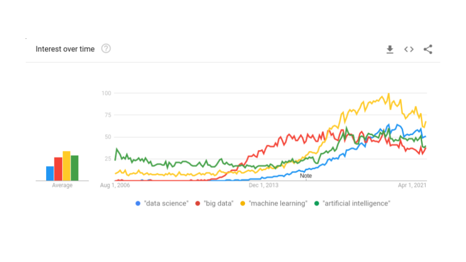
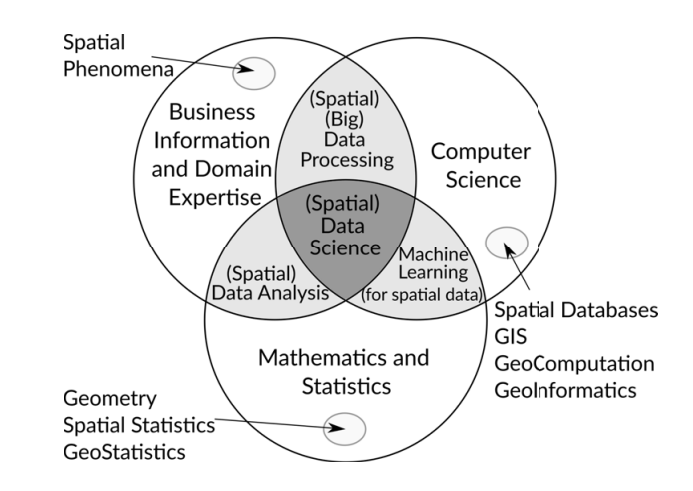

# The Contemporary Context: Data Science and other Buzzwords

## The rise of Big Data and Machine Learning

The last decade has witnessed a convergence of exciting developments
that together have catalyzed the emergence of a new approach  

playing Atari with deep reinforcement learning @VMninEtAl2013
mastering game of Go @DSilverEtAl2016

@DLaney2001 declared that "data management challenges [had] exploded
along three dimensions: volume, velocity, and variety".

data deluge and the end of theory [@CAnderson2008]

data avalanche @HMiller2010

big data and human geography @RKitchin2013
data revolution @RKitchin2014

urban data
@DArribas-Bel2014

fourth paradigm @THeyEtAl2009

## No-Free-Lunches, Interpretable Algorithms, and the Resurrection of Theory

no free lunches
[@DWolpertMacready1995; @DWolpertMacready1997; @DWolpert2002; @DWolpert2013; @DWolpert2021]

@SShalev-ShwartzBen-David2014

also explainability of AI

@LGilpinEtAl2018 interpretability overview

@SEnniHerrie2021 biases into hypotheses for ML

@AHolzinger2018 from ML to explainable AI
@CRudin2019 explaining black box models vs interpretable models
@KFramling2020

## Data Scientists, Domain Knowledge, and the Call for a Geographic Data Science

also data scientists.
@RDorschel2021

sexiest job @TDaveportPatil2012

@DConway2011

data science... @FProvatFawcett2013
@Mloukides2011

@DDonoho2017

@JWu1997 @JTukey1962

computational social science [@DLazerEtAl2009; @RConteEtAL2012]

*geographic* data science [@ASingletonArribas-Bel2021] or *spatial* data

science [@LAnselin2016]

geographic data mining @HMillerHan2009

geocomputation @SOpenshawAbrahart1996
geocomputation @PLongleyEtAl1998, @RHarrisEtAl2017

Geographic Information Systems and Science [@MGoodchild1991;
@MGoodchild1992; @MGoodchild2010]

@MGrahamShelton2013 geography and big data

## Geodemographics as an exemplar of Big Data analysis

spatial big data and geodemographics
@CDaltonThatcher2015

